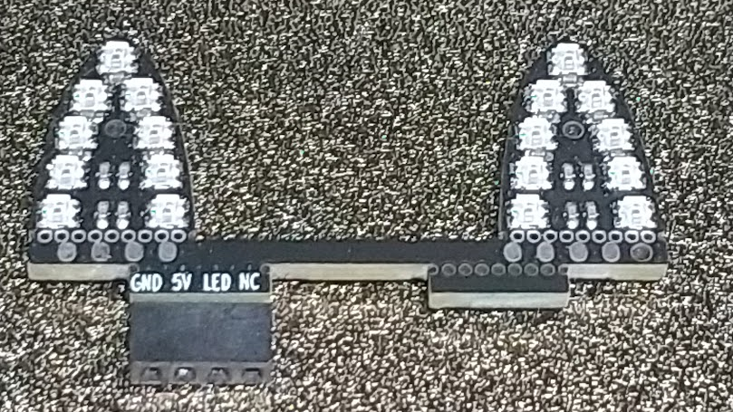
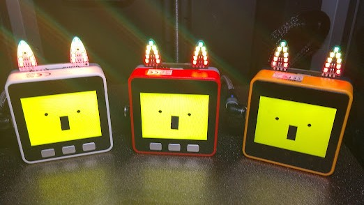
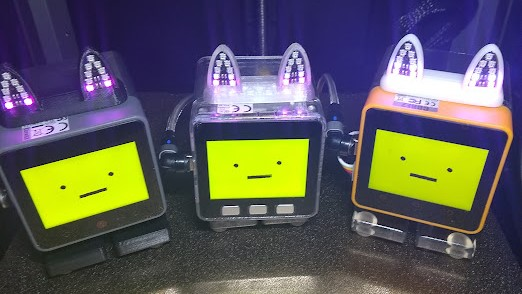

# Nekomimi LED  
M5StackのGO BOTTOM等に直接取り付けれるオリジナルのネコミミ型LED基板です  
NeoPixel(WS2812)互換のRGB LEDが左右に9個ずつ合計18個付いており独立して色や明るさ等を制御することができます  

# 回路図、作り方
  回路図、作り方等の詳細については[こちら](schematics/docs/README.md)へ  
  オプション外装の利用方法については[こちら](case/README.md)へ
   

# 使い方
主に下記に直接取り付けることができます  
- <a href="https://docs.m5stack.com/ja/base/m5go_bottom" target="_blank">M5GO BOTTOM</a> BASIC用 (M5GO,FIREは標準添付)   
- <a href="https://docs.m5stack.com/ja/base/m5go_bottom2" target="_blank">M5GO BOTTOM2</a> CORE2用 (CORE2 for AWS は標準添付)
- <a href="https://docs.m5stack.com/ja/module/M5GO3%20Bottom" target="_blank">M5GO3 BOTTOM</a> CoreS3用 (DINベースにそのままつけた場合はコネクタ位置が異なるため左寄りになります)  
取り付け例  

なおM5Stick系やM5Atom系、M5DialやM5NanoC6などもGROVEポートがあれば基本的に利用可能です  
物理的に干渉する場合はGROVEケーブルとGROVEコネクタを使えば[延長して取り付ける](docs/images/cable_connect.png){:target="_blank"}こともできます   
   

また[オプション外装](case)を利用してはんだ付けを含む工作を行う場合は下記に取り付け可能となります
  - 直接取り付けできる前記のGO BOTTOM系全て
  - [DIN BASE](https://docs.m5stack.com/ja/base/DIN%20BASE){:target="_blank"} (CoreS3に標準添付)  
  - ししかわさん版(アールティVer. α版,β版)ｽﾀｯｸﾁｬﾝ (V0.2.1基板にPH-4Pコネクタ実装済の物)  

 
オプション外装を利用した取り付け例  

&emsp;左から DIN BASE基板ｽﾀｯｸﾁｬﾝ、ししかわさん版ｽﾀｯｸﾁｬﾝ、GO BOTTOM2基板ｽﾀｯｸﾁｬﾝ  

  

# 使用するGPIO
GO_BOTTOM系やDIN BASEへの接続 または ｽﾀｯｸﾁｬﾝ基板 V0.2.1 の場合は  
PortBのOUTPUT(O)端子を利用してGPIO番号は下記となります  
|Core|利用するGPIO|  
|:--|:-:|  
|BASIC/GRAY/M5GO/FIRE|26|  
|CORE2/CORE2 for AWS|26|  
|CoreS3|9|  

# ソフトウエアでの利用について
Arduino IDE や VSCode + PlatformIO で利用する場合は
[FastLED](https://github.com/FastLED/FastLED){:target="_blank"}や[Adafruit NeoPixel](https://github.com/adafruit/Adafruit_NeoPixel){:target="_blank"}等のライブラリで利用できます  
UIFlowで利用する場合はUnit RGB で LEDの数を 18 として利用できます  
その他に関しては NeoPixel を操作できるライブラリ等があれば利用できると思います

# サンプルプログラム
サンプルプログラムとして [m5stack-avatar-mic-nekomimi_led](https://github.com/washishi/m5stack-avatar-mic-nekomimi_led){:target="_blank"} を用意しました  
音に合わせてAvatarが口パクしたり、傾いたりすると共にNekomimi LEDが音量に応じて光ります
※Takao Akaki (mongonta0716) さんの [m5stack-avatar-mic](https://github.com/mongonta0716/m5stack-avatar-mic){:target="_blank"} を改変したものです
