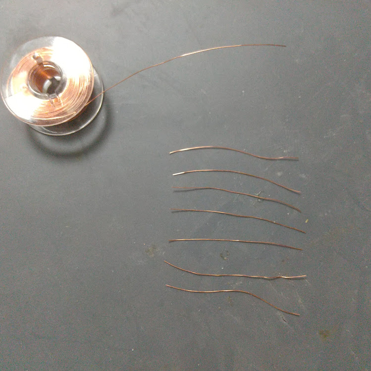
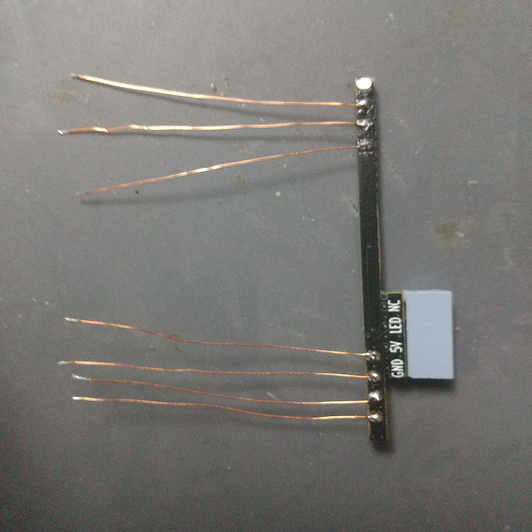
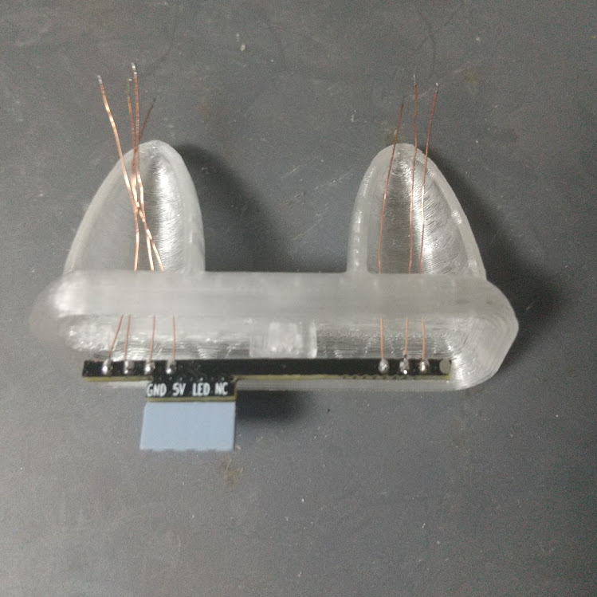
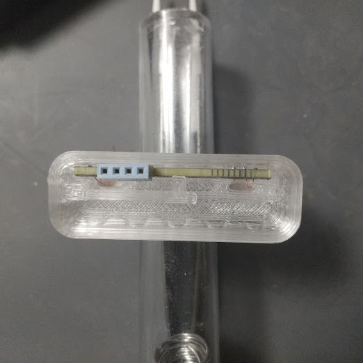
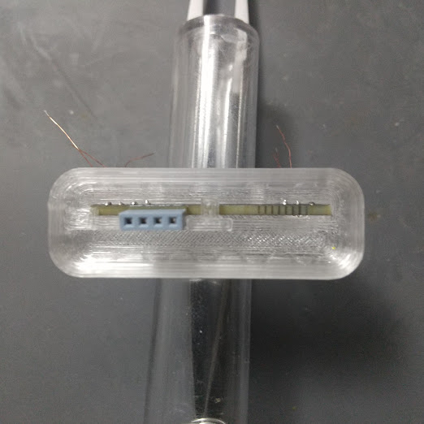
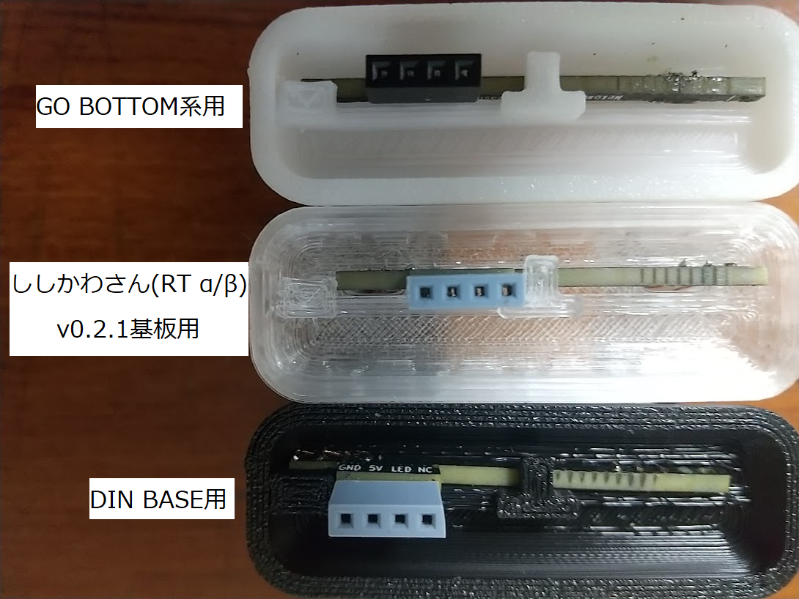
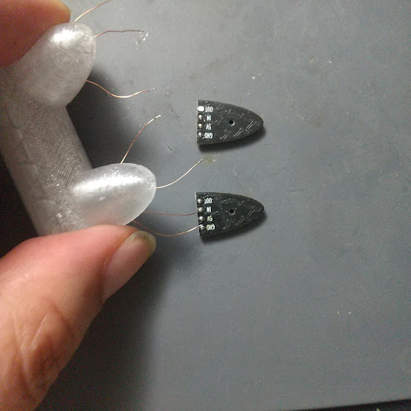
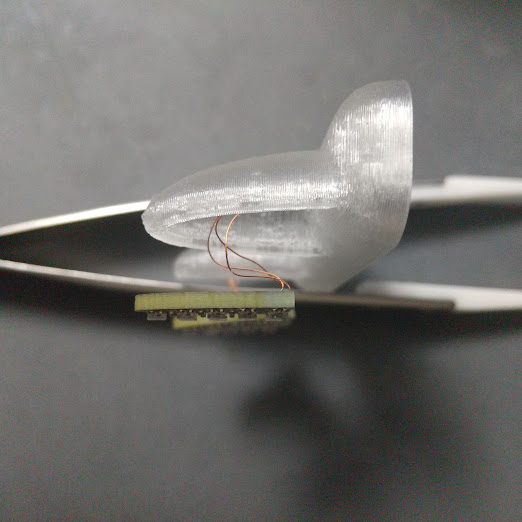
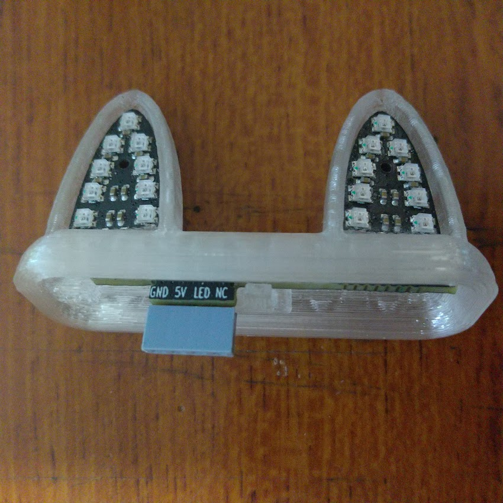
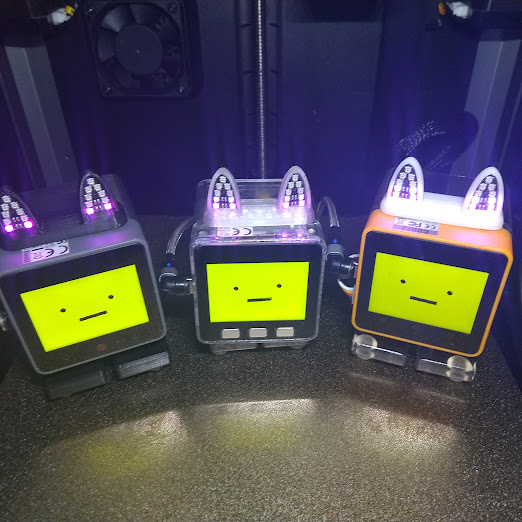

# オプション外装の利用方法
## 必要なもの
 - はんだごて、ハンダ 等
 - ピンセット
 - ニッパー
 - やすり
 - オプション外装 ([case](../case)配下にある3Dデータを自分で印刷 または JLCPCBなどの製造会社へ委託等してください  
   なおstlとstep形式のデータがありますが内容は同じものです)
 - 0.16mmぐらいの ポリウレタン(UEW)線 30cm程（参考：[秋月電子 111531](https://akizukidenshi.com/catalog/g/g111531/)）
 - 瞬間接着剤や両面テープ等の固定するもの

作成方法  
 - [基板の加工](../schematics#基板の加工について)をします  
 - ポリウレタン(UEW)線 を 3cmぐらいに切ったものを7本作り両端をはんだメッキします
 

 - 切り取った基板にはんだ付けします  
 　(写真で下側4本、上側は一番上を除いた3本)  
    

 - 外装の穴にポリウレタン(UEW)線を通します この段階で線の順番がわかるようにしておいてください  
 (わからなくなってしまった場合はテスター等で導通を確認してください)

    
  
 - ピンソケットのついた基板を写真の位置に奥まで押し込みます  
  

 - スライドして出っ張りの下に入れる  
  

 - ししかわさん(RT α,β版)用の場合は右側  
DIN BASE用の場合は左側に基板を寄せます  
 

 - ネコミミ部分のはんだ付けを行います  
 (写真では上部側のOUT端子は利用しません)  
 
 
 - ポリウレタン(UEW)線を曲げて外装にネコミミ部分を押し込みます  
 またそのままでは外れやすいので瞬間接着剤や両面テープ等で固定してください

 - 完成  
 

 - ｽﾀｯｸﾁｬﾝに取り付けた場合  
  
