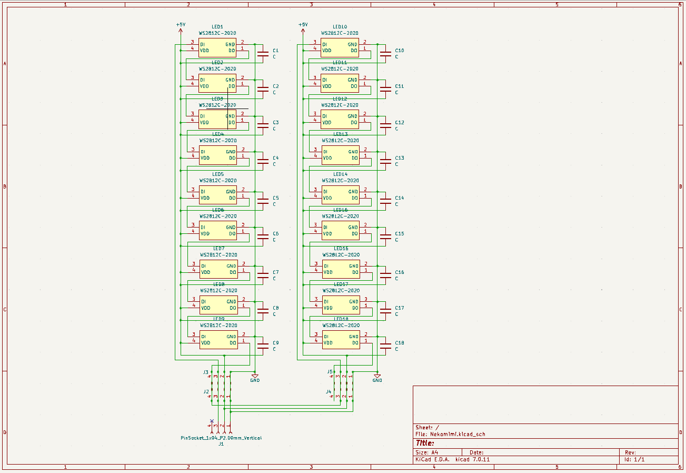
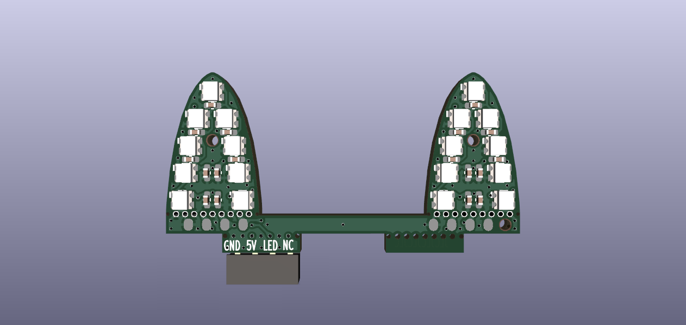
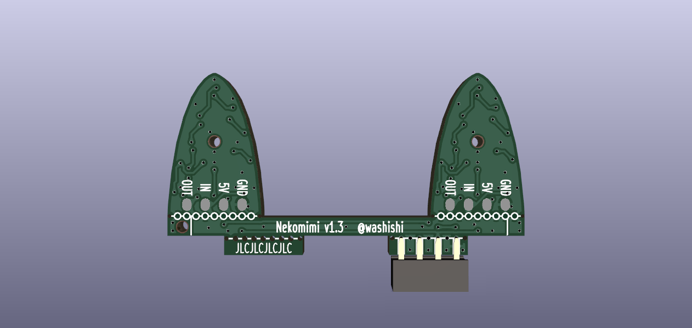
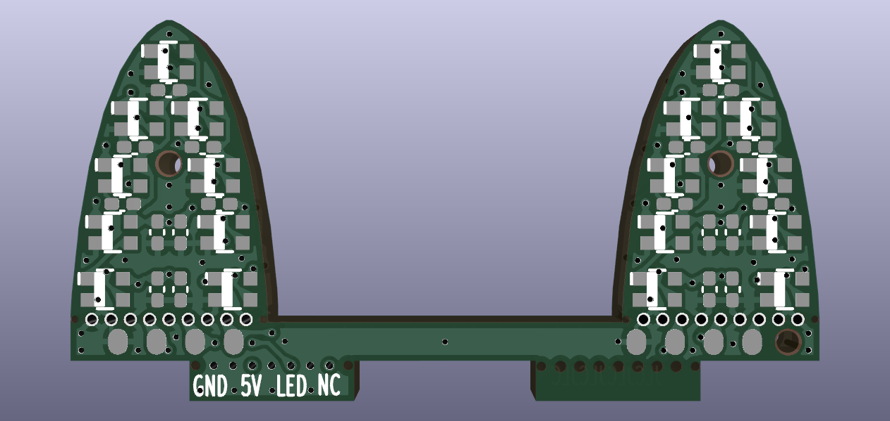
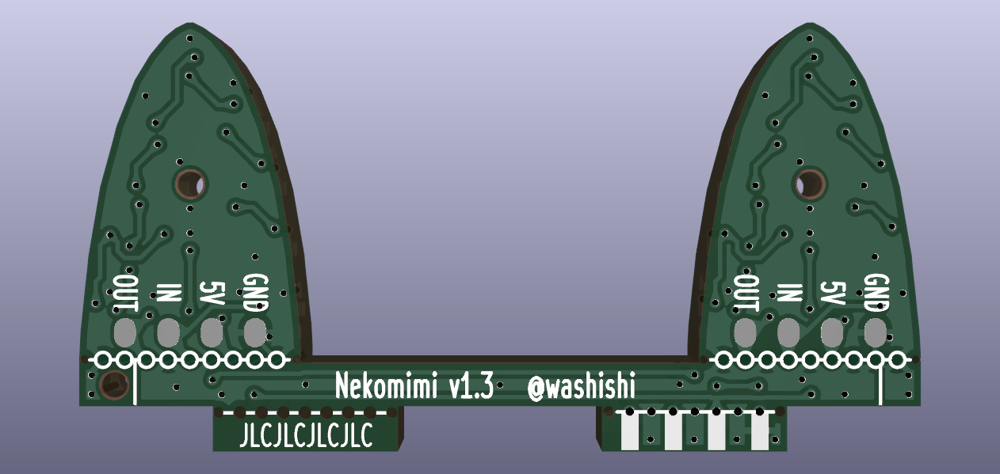
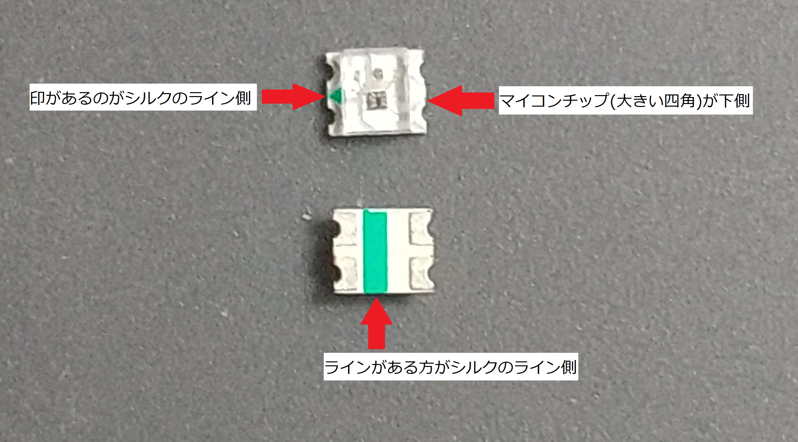
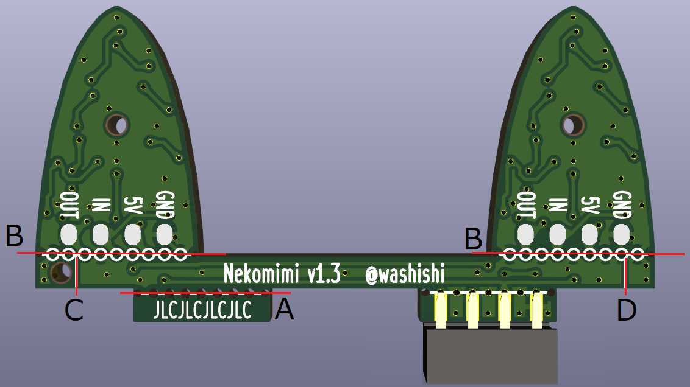
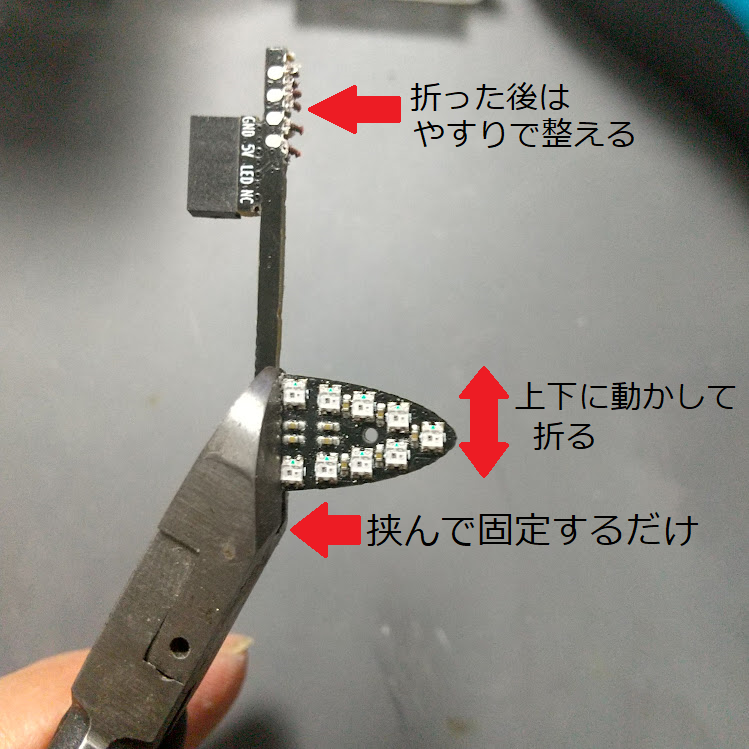

# 回路図  
回路的にはマイコン内蔵RGB LEDを18個繋げただけの回路です  

   
   

# 部品表
|品名|部品番号|型番等|数量|入手先(参考)|備考|
|:--|:--|:--|--:|:--|:--|
|基板|-|Nekomimi_LED 基板|1|JLCPCBへ発注|基板の発注について参照|
|コンデンサ|C1～C18|チップ1005サイズ 0.1uF|18|秋月電子 ([113377](https://akizukidenshi.com/catalog/g/g113377/)) 　※1パック25個||
|LED|LED1～LED18|マイコン内蔵RGBLED WS2812C-2020 または互換品|18|秋月電子 ([115068](https://akizukidenshi.com/catalog/g/g115068/)) 　※1パック 10個||
|ピンソケット|J1|2mmピッチ 4ピン|1|秋月電子 ([103870](https://akizukidenshi.com/catalog/g/g103870/)) 　※5ピン目のところで切って利用||
 

# 基板実装図  
表面：チップコンデンサ、LEDをはんだ付けします  
  
裏面：GROVEコネクタへ差し込むためのピンソケットをはんだ付けします  

# 基板パターン図  
 [schematics](../../schematics/)ディレクトリに[KiCad](https://www.kicad.org/)で作成したデータがあります  
  
  

# 基板の発注について  
[JLCPCB](https://jlcpcb.jp/)用に作った発注用データがあるのでこちらを利用して発注してください
- ガーバーファイル(基板データ) [Nekomimi.zip](../production/Nekomimi.zip) 
- PCBA用 BOMファイル(部品情報) [bom.csv](../production/bom.csv)
- PCBA用 CPLファイル(位置情報)  [positions.csv](../production/positions.csv)  

## 発注時の指定について
- ガーバーファイルの追加：事前にダウンロードしたガーバファイル [Nekomimi.zip](../production/Nekomimi.zip)をクリックして選択 (展開せずzipのまま選択してください)
- PCB数量：作成する基板の枚数 最低5枚から
- PCBカラー： お好みの色を選んでください
- 発注番号の削除：「場所の指定」を選択 (JLCJLCJLCJLCのシルク位置に入ります) 
- 配送方法の選択： 特に急がない場合は一番安いOCS NEPでいいと思います

&emsp;その他はデフォルトで問題ありません  

&emsp;PCB組み立て(PCBA)も頼む場合は下記を参考にしてください  

- 組立サイド：「トップ面」
- ツーリングホール ：「お客様に追加される」
- BOMファイルの追加 ：事前にダウンロードしたBOMファイル [bom.csv](../production/bom.csv)をクリックして選択
- CPLファイルの追加 ：事前にダウンロードしたCPLファイル [positions.csv](../production/positions.csv)をクリックして選択
- 部品表 (実装部品の選択)：コンデンサ(C1～18)とLED(LED1～18)が選択可能です  
  しかしLEDが熱に弱い等で実装難易度の難しい部品という扱いになっている為選択すると標準PCBAへの切り替えが必要となります  
  またエッジレール付加も必要となりかなり高額になってしまいます  
  そのため個人的には実装も頼む場合はコンデンサだけにしてLEDは自分ではんだ付けした方がいいと思います
- 配送方法の選択：特に急がない場合は一番安いOCS Expressでいいと思います
 
 

参考として5枚作成して一番安い配送で東京に配送した場合のおおよその費用です  
|区分|基板費用|実装・部品代|発送方法|送料|合計|
|:--|--:|--:|:--|--:|--:|
|基板製造のみ|$2.00|-|OCS NEP|$0.96|$2.96|
|コンデンサのみ実装|$2.00|$9.89|OCS Express|$2.01|$13.90|
|コンデンサとLEDを実装|$2.00|$42.11|OCS Express|$9.13|$53.24|
 

# 基板の組み立てについて
組み立ては以下のような工具が必要です
 - はんだごて(こて先の細いもの)、ハンダ
 - フラックス および フラックスクリーナー等
 - ピンセット
 - ニッパー
 - やすり(ダイヤモンドやすりがいいです、100均で売っているもので十分です)

　なおチップ部品のはんだ付けは一応手はんだでも可能ですが
ヒートテーブル等を使ったリフローが行えると比較的容易です  
 

## 制作方法
 - ピンソケットが4ピンの物でない場合はニッパーで5ピン目のところで切断してやすりで整えて4ピンのピンソケットを作ります
 - 基板を[JLCPCB](https://jlcpcb.jp/)等の製造業者に発注します
 - チップコンデンサ、LED の未実装のチップ部品を実装します
 - ピンソケットをはんだ付けします

LEDの実装向きは下記の様になります  
  ※下記は互換LEDの写真です、LEDによっては印やラインは一部無い物もあります  
  

# 基板の加工について  
　 そのままでも使えますが、PortCを使いたい場合や[オプション外装を利用](../../case/README.md#オプション外装の利用方法)したい場合は基板の加工が必要です  

裏面図  
  
- A：PortCを利用する場合やオプション外装を利用してGO BOTTOM系以外に使用する場合に切ります
- B：オプション外装を利用する場合に切ります
- C：オプション外装を使ってししかわさん版(アールティVer. α版,β版)ｽﾀｯｸﾁｬﾝ  
　 (V0.2.1基板にPH-4Pコネクタ実装済の物)に取り付ける場合にBを切った後に切ります
- D：オプション外装を使ってDIN BASEに取り付ける場合にBを切った後に切ります

## 切り取り方法 (一例)
必要なもの  アートナイフまたはカッターナイフ等、ニッパー、やすり
 - 切り取りたい場所をアートナイフやカッターナイフである程度切込みが付くまで切ります(可能であれば両面から切ってください)
 - 切込みを付けた部分をニッパーで挟む(切るのではなく挟むだけ、ラジオペンチ等で挟むと基板のパターンを傷つけてしまう場合があるので注意)
 - 切り取りたい部分を上下に押して割って切り取ります
 - 切り取った後のバリはやすりで整えます (切断面のスルーホールのメッキがなくなるまで削って大丈夫です、また粉塵が出るので各自対策等願います)

  

